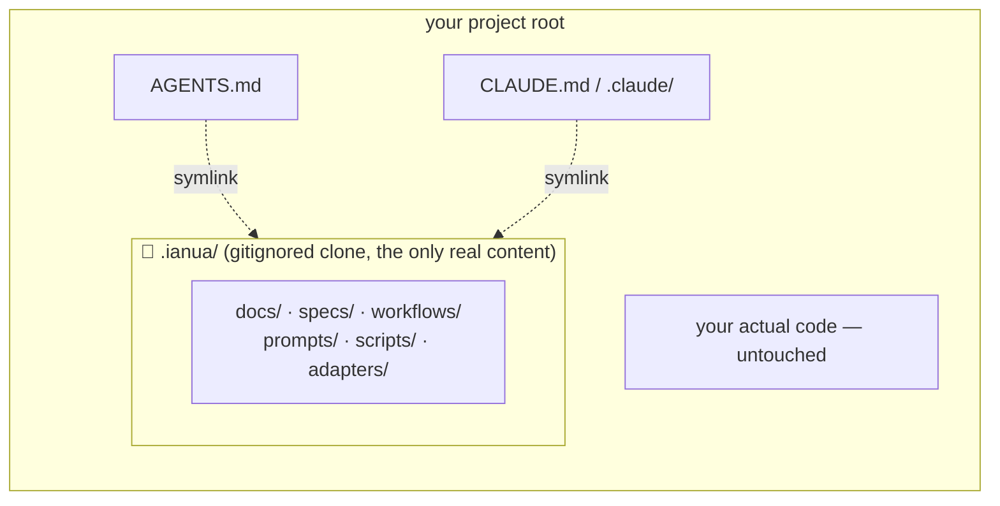
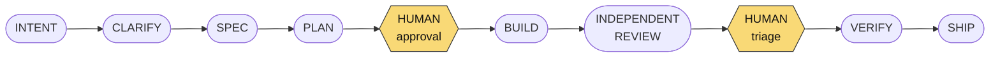

# Ianua — AI Native Engineering Workspace

*Bu belge Türkçe de mevcut: [README.tr.md](README.tr.md)*

**A general-purpose, technology-agnostic bootstrap for building software with AI — under control.**

> It doesn't matter what you're building. Ianua gives you a starting environment where context,
> decisions, specs, roles, quality gates, and verification are managed in files — not lost in chat.

Use this repo as a GitHub template for a new project, or clone it into `.ianua/` inside a project
you already have, install the adapter for your AI tool, run the bootstrap workflow, and start your
first feature. No frameworks, no dependencies, no code generators — a working *system*, written in
Markdown plus a handful of small scripts.

## Using this in a project you already have

New project → use this repo as a GitHub template; Ianua *is* the repo, nothing nests. Existing
project → clone Ianua into a `.ianua/` folder instead of spreading its files across your repo root:

```bash
cd your-existing-project
git clone https://github.com/yctatli/ianua.git .ianua
rm -rf .ianua/.git                # you're not vendoring Ianua's own history into yours
echo ".ianua" >> .gitignore       # scripts/init also does this for you if you skip it

./.ianua/scripts/init claude-code # or: codex | github-copilot | cursor | generic
export IANUA_ALLOW_CORE_EDIT=1    # bootstrap needs to write AGENTS.md — see "Design principles"
# open your AI tool here and run /bootstrap (Claude Code) or the bootstrap skill (Codex)
```

`scripts/init` auto-detects that it's running from inside a folder literally named `.ianua` and
switches to **nested mode**: instead of copying files into your repo root, it symlinks just what
your AI tool needs to discover Ianua there — `AGENTS.md`, `CLAUDE.md`, `.claude/` (Claude Code),
`.agents/` + `.codex/` (Codex CLI), etc. — each one a pointer, not a copy. Everything real
(`docs/`, `specs/`, `workflows/`, `prompts/`, `scripts/`, `adapters/`) stays inside `.ianua/`, which
you `git pull` to update the same way you'd update any tool. Nothing it creates outside `.ianua/`
carries real content, so all of it is meant to be gitignored — `scripts/init` adds the one line
that matters (`.ianua`) automatically; the handful of symlinks it drops at your root are covered by
most teams' existing "don't track AI tool config" gitignore rules (`.claude/`, `CLAUDE.md`,
`AGENTS.md`, `.codex/`, `.agents/` — add them if you don't already ignore these).



Re-running `./.ianua/scripts/init <adapter>` after a `git pull` inside `.ianua/` needs nothing
else — the symlinks already point at the current content.

## Why this exists

Most AI coding advice is prose nobody enforces. An AI agent's behavior is only shaped by three
mechanical channels:

1. **Context it auto-loads.** `AGENTS.md` is read at session start by every major agent. Everything
   else matters only if it's pointed to from there.
2. **Verification it can run.** Agents work in a run–test–fix loop. When checking is one cheap
   command (`scripts/check`), the agent disciplines itself. When it isn't, the agent says "done"
   without proof.
3. **Rules it cannot bypass.** Prose is advice; tooling is law. Hooks, permission denies, and CI
   gates don't rely on the agent remembering anything.

Every file in Ianua connects to one of these channels — plus one more thing prose can't give you:
**process memory.** Intent, decisions, and evidence live in files that survive every session.

## The three layers

| Layer | What | Ages with |
|---|---|---|
| **Core** (`docs/`, `specs/`, `workflows/`, `prompts/`, `scripts/`, `AGENTS.md`) | The system: context, specs, ADRs, roles, gates, verification, recovery. 100% tool- and stack-agnostic. | Engineering practice (slowly) |
| **Adapters** (`adapters/`) | Thin per-tool wiring: Claude Code, Codex CLI, GitHub Copilot, Cursor, generic. Pointers + tool-specific extras only — rules are never duplicated here. | AI tools (they change; core doesn't) |
| **Packs** (roadmap) | Optional stack presets (.NET, Spring, Node, Python, React): conventions/testing/CI suggestions. Not in v1 — the core works without them. | Ecosystems |

## Quickstart

```bash
# 1. New project: use this repo as a GitHub template.
#    Existing project: clone into .ianua/ first — see "Using this in a project you already have".
./scripts/init claude-code        # or: codex | github-copilot | cursor | generic
#    (nested install: ./.ianua/scripts/init claude-code — same command, auto-detected)

# 2. Bootstrap writes AGENTS.md / scripts/check.conf / adapter files, all protected by the
#    core-file-lock hook (see "Design principles") — allow it for this session first:
export IANUA_ALLOW_CORE_EDIT=1

# 3. Open your AI tool and run the bootstrap workflow
#    Claude Code:  /bootstrap
#    Codex CLI:    $bootstrap   (after trusting the project — see adapters/codex/README.md)
#    Other tools:  paste prompts/bootstrap.md

# 4. The AI interviews you — product, domain, stack, boundaries, conventions, mode —
#    and fills docs/, AGENTS.md, and scripts/check.conf from your answers.

./scripts/doctor                  # 5. Confirm the workspace is healthy

# 6. Start your first feature or bugfix — only ONE workflow runs per task, matched
#    to what you're asking for (see "The loop"), never all of them at once.
#    Claude Code:  /new-feature "short description"   or   /fix-bug "what's broken"
#    Other tools:  follow workflows/feature-development.md or workflows/bug-fix.md
```

Works for **new projects** (empty repo) and **existing codebases** (bootstrap detects your stack
and adapts the rules to what's already there).

## The loop

Every piece of work runs through a workflow, and every workflow enforces the same spine:



Two human checkpoints are never automated: **plan approval** and **finding triage**.

### Two operating modes

Chosen at bootstrap, recorded in `AGENTS.md`, honored by every workflow:

| | **Lite** — solo developers, low-risk work | **Strict** — teams, critical systems |
|---|---|---|
| Spine | Spec → Plan → Build → Review → Verify | Full spine incl. Intent → Clarify |
| Human gates | Plan approval | Spec approval · plan approval · finding triage · ship decision |
| Review | Independent (separate session/subagent) | Independent + role separation enforced |
| Ceremony | Minimum viable | Full evidence trail |

Running the full process on every project is unnecessary cost; running none is uncontrolled risk.
Pick per project — or per feature.

Mode is about **ceremony** (how many gates); it's orthogonal to **scope** (how big the unit of
work is). Two small, narrow escape valves handle scope, in every mode:
- A genuinely trivial, zero-behavior-change, single-file edit can skip the spec entirely —
  `workflows/README.md`, "Trivial changes." The bar is intentionally high; default to writing the
  spec when in doubt.
- Several specs that only make sense together as one outcome can be grouped under
  `specs/epics/` — a pointer, not a shortcut past any spec's own spine. See `workflows/README.md`,
  "Epics," and run `./scripts/status` for a rollup of everything in flight.

## Monitoring progress

There's no separate dashboard — visibility comes from the workflow files and the specs themselves,
not a UI you have to keep open:

- **While it's running:** the agent is literally reading the workflow file step by step and
  narrating each one in chat — "writing the spec," "plan's ready, need your approval," "build
  done, handing off to review." At every **[GATE: human]** it stops and genuinely waits; it never
  advances past plan approval or finding triage on its own.
- **At any point, across everything in flight:**
  ```bash
  ./scripts/status      # nested install: ./.ianua/scripts/status
  ```
  Reads every spec in `specs/active/` and prints its Status, Mode, plan status, Definition-of-Done
  progress (`3/6 checked`, derived from the spec's own `- [x]` checkboxes), and whether the
  security dimension of review is addressed or still open — plus any epics. Nothing here is
  hand-maintained; it's regenerated from the same files every time, so it can't drift from reality.
- **Is it actually green?**
  ```bash
  ./scripts/check       # prints "==> build", "==> test", "==> security", ... — stops at the first failure
  ./scripts/doctor       # workspace health: structure, configured mode/language, adapter presence
  ```

So: watch the chat transcript for what's happening *right now*, run `scripts/status` for a
point-in-time rollup of *everything*, and trust `scripts/check`'s exit code — not a claim in
chat — for whether it actually passed.

## What's in the box

Paths below are relative to wherever Ianua's core actually lives: the repo root in a template
install, `.ianua/` in a nested one (see "Using this in a project you already have").

| Path | Purpose |
|---|---|
| `AGENTS.md` | The signpost every agent auto-loads: invariant rules, operating mode, where everything lives. Rewritten by bootstrap; invariants survive. Protected by the core-file-lock hook. |
| `docs/` | Long-term memory: architecture, domain language, conventions, testing, security, git rules — templates filled at bootstrap, evolve with features (not locked). |
| `docs/decisions/` | ADRs — decisions with rationale, numbered and superseded rather than edited. See "Decisions log" below. |
| `docs/roles/` | Role cards bound to responsibility, not technology: Analyst, Developer, Reviewer, **Security**, QA. Producer and verifier are never the same session. See "Roles" below. |
| `specs/` | One spec per piece of work: intent, behavior, testable acceptance criteria. `active/` → `done/` (immutable once shipped, no override). Plans live in `specs/plans/`; specs that share one outcome can be grouped in `specs/epics/`. |
| `workflows/` | The processes: bootstrap, feature-development, bug-fix, refactor, incident. Exactly one runs per task, matched to what it is — never all of them at once. Each step points to its prompt. |
| `prompts/` | Reusable prompt bodies with placeholders. `prompts/recovery/` is the catalog of safe ramps (R-01…R-13) for when things go wrong. |
| `adapters/` | Per-tool wiring. `scripts/init <tool>` installs one. Claude Code and Codex CLI adapters both include model/effort routing and a security-role subagent/skill — see each adapter's own README. |
| `scripts/check` | The single verification contract: humans, agents, hooks, and CI all run this one command. Stack-specific internals (including a `security:` step) live in `check.conf`, written at bootstrap. |
| `scripts/doctor` | Workspace health: structure, configuration state, adapter presence. |
| `scripts/status` | A derived rollup of every spec in `specs/active/` (status, mode, DoD progress, security-dimension state) and any epics — nothing hand-maintained, regenerated from the same files every time. |
| `.github/` | CI that runs the same `scripts/check` + a PR template mirroring the gates. |

## Roles

Five role cards in `docs/roles/`, each bound to responsibility, not technology or job title.
Mechanically, **role = session** — a second window/terminal or a read-only subagent is enough,
no special tooling required. Full detail: `docs/roles/README.md` and each `docs/roles/<name>.md`.

| Role | Owns | May never |
|---|---|---|
| **Analyst** | Intent → Clarify → Spec | Write technical solutions into Requirements, write code, resolve ambiguity by assumption |
| **Developer** | Plan → Build → fix rounds | Start without an approved plan, weaken/skip tests, exceed the plan's file scope silently |
| **Reviewer** | Independent REVIEW | Write or modify any file — read-only by design |
| **Security** | Independent SECURITY pass — its own session in **strict** mode; collapses into Reviewer's own security dimension in **lite** mode | Write or modify any file — read-only, same guarantee as Reviewer |
| **QA** | Verify meaning against evidence, minimal reproductions | Write production code, fix bugs, soften acceptance criteria |

The load-bearing rule underneath all five: *the mind that produces cannot audit itself.* Every
review — Reviewer's or Security's — runs from files (diff + spec), never from the builder's chat.

## Decisions log (ADRs)

Every significant, hard-to-reverse choice this workspace's own tooling has made lives in
`docs/decisions/`, numbered, never edited after acceptance — a superseding decision gets a new ADR
and a status update on the old one, so the reasoning trail (including reversals) stays intact.
Read the full ADRs for the actual rationale and alternatives considered; this is just the index:

| ADR | Decision | Status |
|---|---|---|
| [0001](docs/decisions/0001-codex-cli-adapter.md) | Add a Codex CLI adapter (skills, PreToolUse hook, trust requirement) | Accepted |
| [0002](docs/decisions/0002-claude-code-model-effort-routing.md) | Per-role model/effort routing across Claude Code subagents | Accepted |
| [0003](docs/decisions/0003-security-enforcement.md) | Security as an enforced `check.conf` step + skill-backed review pass | Superseded by 0004 (its automated-check decisions still stand) |
| [0004](docs/decisions/0004-dedicated-security-role.md) | Dedicated Security role, mode-graduated (reverses one call in 0003) | Accepted |
| [0005](docs/decisions/0005-core-file-lock.md) | Core-file-lock: protect this workspace's own process files during dev | Accepted |
| [0006](docs/decisions/0006-security-severity-gating.md) | Security finding severity taxonomy (Critical/High/Medium/Low) + ship-gating | Accepted |
| [0007](docs/decisions/0007-test-standards.md) | Test standards: risk-tiered levels, mandatory categories, named anti-patterns | Accepted |
| [0008](docs/decisions/0008-bmad-adoption.md) | Selective BMAD-METHOD adoption: status rollup, trivial-change exception, epics, lesson | Accepted |
| [0009](docs/decisions/0009-rename-to-ianua.md) | Rename the project: ANEW → Ianua | Accepted |
| [0010](docs/decisions/0010-nested-install.md) | Nested install: `.ianua/` as a symlinked clone for existing repos | Accepted |
| [0011](docs/decisions/0011-chat-language.md) | Bootstrap asks for a chat language, recorded in `AGENTS.md` | Accepted |

Use `/adr` (Claude Code) or `$adr` (Codex) to discuss and record the next one — it drafts options
with a recommendation first, writes the file only after you decide (`prompts/adr.md`).

## Memory — continuity across sessions

Two separate layers answer "how does this not get forgotten," and they don't overlap:

**In the repo (tool-agnostic, git-tracked, anyone can read it):** specs move `active/` → `done/`
with a filled-in scorecard — the record of *what happened and what proved it*. ADRs (above) are
the record of *why a call was made*, including changed minds. Both are files, so any AI tool
reading this repo — Claude Code, Codex, a human three months from now — sees the same history.
This is the primary, durable memory and it costs nothing extra to use: it's just the workflows.

**Assistant-side (Claude Code only, per-user, not in the repo):** Claude Code can keep its own
persistent memory across sessions — notes about the project, your preferences, and how you like to
work, stored outside this repo and tied to your account. It's *not* committed to git, *not* visible
to Codex or a teammate, and *not* a substitute for the in-repo record above — treat it as a
convenience layer that saves you from re-explaining preferences, never as the place a real decision
or acceptance criterion lives. If you're relying on something for the project's actual history, it
belongs in a spec, an ADR, or `docs/`, not only in assistant memory.

## Design principles

**Context lives in files, not in chat.** Sessions forget; files don't. Architecture, decisions,
conventions, and specs are written down and pointed to — `AGENTS.md` stays a short signpost
(≤ 40 lines), never a handbook, because long context files get ignored in the middle.

**No spec, no code.** Work starts by writing down intent and testable acceptance criteria. The most
expensive bugs happen before the first line of code — when human, business, and AI each understood
a different sentence.

**The producer never verifies its own work.** Review runs in a separate session (or a read-only
subagent) that sees the diff and the spec — not the builder's rationalizations.

**Evidence over claims.** "Done" means `scripts/check` is green and every acceptance criterion maps
to a test or a reproducible observation. "It works" is not a status.

**Proposal rule.** Every question, option, or finding an agent raises must include its own
recommendation and rationale. The human decides — faster, with the agent's reasoning visible.

**One verification contract.** There is exactly one way to ask "is this good?": `scripts/check`.
The agent cannot pass locally and fail in CI by running different commands.

**Tooling is law, concretely.** The installed adapters' PreToolUse hook won't let an agent touch
`specs/done/` at all, or this workspace's own process files (`AGENTS.md`, `workflows/`, `prompts/`,
`scripts/`, `adapters/`, `docs/roles/`, `docs/decisions/`) without `IANUA_ALLOW_CORE_EDIT=1` set
consciously for that session — so "don't edit the process files by accident" isn't a rule an agent
has to remember, it's one it structurally can't break. See `docs/decisions/0005-core-file-lock.md`.

## Adapting it

Everything is plain Markdown and POSIX shell — edit, don't fork the philosophy:

- Gates too heavy? Switch the mode line in `AGENTS.md` to `lite`, or tailor workflows per project.
- Tool not listed? Copy `adapters/generic/` and wire your own; core never changes.
- Want stack presets? That's the packs layer — coming after v1 proves the core.

## License

MIT
