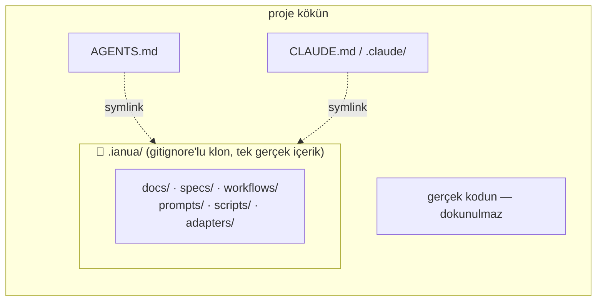
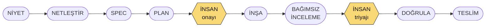

# Ianua — AI Native Engineering Workspace

*This document is also available in English: [README.md](README.md)*

**Yapay zekâ ile yazılım geliştirmek için genel amaçlı, teknolojiden bağımsız — kontrollü — bir başlangıç iskeleti.**

> Ne inşa ettiğin önemli değil. Ianua sana context, kararlar, spec'ler, roller, kalite kapıları ve
> doğrulamanın dosyalarda yönetildiği — sohbette kaybolmadığı — bir başlangıç ortamı verir.

Yeni bir proje için bu repoyu GitHub template olarak kullan, ya da zaten sahip olduğun bir projenin
içine `.ianua/` klasörü altına klonla; AI aracın için adaptörü kur, bootstrap workflow'unu çalıştır
ve ilk feature'ına başla. Framework yok, bağımlılık yok, kod üretici yok — Markdown ve birkaç küçük
script'ten oluşan çalışan bir *sistem*.

## Bunu zaten sahip olduğun bir projede kullanmak

Yeni proje → bu repoyu GitHub template olarak kullan; Ianua *repo'nun kendisi olur*, hiçbir şey
gömülmez. Mevcut proje → Ianua'nın dosyalarını repo kökünün her yerine dağıtmak yerine bir `.ianua/`
klasörüne klonla:

```bash
cd mevcut-projen
git clone https://github.com/yctatli/ianua.git .ianua
rm -rf .ianua/.git                # Ianua'nın kendi git geçmişini kendi reponuza taşımıyorsunuz
echo ".ianua" >> .gitignore       # atlarsan scripts/init bunu senin için zaten yapıyor

./.ianua/scripts/init claude-code # ya da: codex | github-copilot | cursor | generic
export IANUA_ALLOW_CORE_EDIT=1    # bootstrap'ın AGENTS.md yazabilmesi için — bkz. "Tasarım ilkeleri"
# AI aracını burada aç ve /bootstrap'ı çalıştır (Claude Code) ya da bootstrap skill'ini (Codex)
```

`scripts/init`, adı tam olarak `.ianua` olan bir klasörün içinden çalıştırıldığını otomatik olarak
tespit eder ve **nested (gömülü) moda** geçer: dosyaları repo köküne kopyalamak yerine, AI aracının
Ianua'yı orada keşfetmesi için gereken minimumu symlink'ler — `AGENTS.md`, `CLAUDE.md`, `.claude/`
(Claude Code), `.agents/` + `.codex/` (Codex CLI) vb. — her biri bir kopya değil, bir işaretçidir.
Gerçek içeriğin tamamı (`docs/`, `specs/`, `workflows/`, `prompts/`, `scripts/`, `adapters/`)
`.ianua/` içinde kalır; onu güncellemek için tıpkı başka bir araç gibi `git pull` yaparsın.
`.ianua/` dışında oluşturulan hiçbir şey gerçek içerik taşımaz, o yüzden hepsi gitignore'lanmak
üzere tasarlanmıştır — `scripts/init` önemli olan tek satırı (`.ianua`) otomatik ekler; kökte
bıraktığı birkaç symlink ise çoğu takımın zaten sahip olduğu "AI araç konfigürasyonunu izleme"
gitignore kurallarına girer (`.claude/`, `CLAUDE.md`, `AGENTS.md`, `.codex/`, `.agents/` — bunları
henüz ignore etmiyorsan ekle).



`.ianua/` içinde bir `git pull`'dan sonra `./.ianua/scripts/init <adapter>`'ı yeniden çalıştırmak
başka hiçbir şey gerektirmez — symlink'ler zaten güncel içeriği gösteriyordur.

## Bu neden var

Çoğu AI kodlama tavsiyesi, kimsenin uygulamaya zorlamadığı laftan ibaret. Bir AI ajanının davranışı
sadece üç mekanik kanaldan şekillenir:

1. **Otomatik yüklediği context.** `AGENTS.md`, her büyük ajan tarafından oturum başında okunur.
   Geri kalan her şey ancak oradan işaret edilirse önem taşır.
2. **Çalıştırabildiği doğrulama.** Ajanlar çalıştır–test et–düzelt döngüsünde çalışır. Kontrol tek
   ve ucuz bir komutsa (`scripts/check`), ajan kendini disipline eder. Değilse, ajan kanıt olmadan
   "bitti" der.
3. **Aşamadığı kurallar.** Söz laf, tooling kanundur. Hook'lar, izin reddetmeleri ve CI kapıları
   ajanın bir şeyi hatırlamasına güvenmez.

Ianua'daki her dosya bu kanallardan birine bağlanır — artı lafın veremeyeceği bir şey daha:
**süreç hafızası.** Niyet, kararlar ve kanıt, her oturumdan sağ çıkan dosyalarda yaşar.

## Üç katman

| Katman | Ne | Neyle yaşlanır |
|---|---|---|
| **Core** (`docs/`, `specs/`, `workflows/`, `prompts/`, `scripts/`, `AGENTS.md`) | Sistemin kendisi: context, spec'ler, ADR'lar, roller, kapılar, doğrulama, kurtarma. %100 araçtan ve stack'ten bağımsız. | Mühendislik pratiği (yavaşça) |
| **Adapters** (`adapters/`) | Araca özel ince kablolama: Claude Code, Codex CLI, GitHub Copilot, Cursor, generic. Sadece pointer + araca özgü ekstralar — kurallar burada asla tekrarlanmaz. | AI araçları (onlar değişir; core değişmez) |
| **Packs** (yol haritası) | Opsiyonel stack ön ayarları (.NET, Spring, Node, Python, React): konvansiyon/test/CI önerileri. v1'de yok — core onlarsız da çalışır. | Ekosistemler |

## Hızlı başlangıç

```bash
# 1. Yeni proje: bu repoyu GitHub template olarak kullan.
#    Mevcut proje: önce .ianua/ içine klonla — "Bunu zaten sahip olduğun bir projede kullanmak" bölümüne bak.
./scripts/init claude-code        # ya da: codex | github-copilot | cursor | generic
#    (nested kurulum: ./.ianua/scripts/init claude-code — aynı komut, otomatik algılanır)

# 2. Bootstrap AGENTS.md / scripts/check.conf / adapter dosyalarını yazar, hepsi core-file-lock
#    hook'u ile korunur (bkz. "Tasarım ilkeleri") — önce bu oturum için izin ver:
export IANUA_ALLOW_CORE_EDIT=1

# 3. AI aracını aç ve bootstrap workflow'unu çalıştır
#    Claude Code:  /bootstrap
#    Codex CLI:    $bootstrap   (projeyi trust ettikten sonra — bkz. adapters/codex/README.md)
#    Diğer araçlar: prompts/bootstrap.md'yi yapıştır

# 4. AI seni mülakat eder — ürün, domain, stack, sınırlar, konvansiyonlar, mode —
#    ve cevaplarına göre docs/, AGENTS.md ve scripts/check.conf'u doldurur.

./scripts/doctor                  # 5. Workspace'in sağlıklı olduğunu doğrula

# 6. İlk feature'ına ya da bugfix'ine başla — her görev için SADECE BİR workflow çalışır,
#    ne istediğine göre eşleşir ("The loop"a bak), asla hepsi birden değil.
#    Claude Code:  /new-feature "kısa açıklama"   ya da   /fix-bug "ne bozuk"
#    Diğer araçlar: workflows/feature-development.md ya da workflows/bug-fix.md'yi izle
```

**Yeni projeler** (boş repo) ve **mevcut kod tabanları** (bootstrap stack'ini tespit edip kuralları
zaten orada olana uyarlar) için çalışır.

## Döngü

Her iş parçası bir workflow'dan geçer, ve her workflow aynı omurgayı uygular:



İki insan kontrol noktası asla otomatikleştirilmez: **plan onayı** ve **bulgu triyajı**.

### İki çalışma modu

Bootstrap'ta seçilir, `AGENTS.md`'de kayıtlıdır, her workflow tarafından uygulanır:

| | **Lite** — solo geliştiriciler, düşük riskli iş | **Strict** — takımlar, kritik sistemler |
|---|---|---|
| Omurga | Spec → Plan → Build → Review → Verify | Intent → Clarify dahil tam omurga |
| İnsan kapıları | Plan onayı | Spec onayı · plan onayı · bulgu triyajı · teslim kararı |
| İnceleme | Bağımsız (ayrı oturum/subagent) | Bağımsız + rol ayrımı zorunlu |
| Tören | Minimum uygulanabilir | Tam kanıt izi |

Her projede tam süreci çalıştırmak gereksiz maliyet; hiçbirini çalıştırmamak kontrolsüz risktir.
Proje bazında — ya da feature bazında — seç.

Mode **törenle** ilgilidir (kaç kapı olduğu); işin büyüklüğüyle (**scope**) ortogonaldir. Scope'u
her modda ele alan iki küçük, dar kaçış valfi var:
- Gerçekten önemsiz, davranış değiştirmeyen, tek dosyalık bir değişiklik spec'i tamamen atlayabilir
  — `workflows/README.md`, "Trivial changes." Bar bilerek yüksek tutulmuştur; şüphedeysen varsayılan
  hep spec yazmaktır.
- Sadece birlikte anlam ifade eden birkaç spec, `specs/epics/` altında gruplanabilir — herhangi bir
  spec'in kendi omurgasının önüne geçen bir kısayol değil, bir pointer. `workflows/README.md`,
  "Epics" bölümüne bak; devam eden her şeyin özeti için `./scripts/status`'u çalıştır.

## Workflow'lar & komutlar

Görev başına bir workflow çalışır — hangisinin çalışacağı **talebin ne olduğuna** göre belirlenir,
kodun zaten var olup olmamasına göre değil (buradaki her workflow mevcut bir kod tabanında da
çalışır; bootstrap kuralları zaten ona uyarlamıştır). Analist, developer ya da yönetici — hepsi
bunları aynı şekilde tetikleyebilir: komutu yaz, sorduğu soruları cevapla, kapılarda onayla/reddet:

| Görev | Ne zaman | Claude Code | Codex CLI | Omurga |
|---|---|---|---|---|
| **Bootstrap** | Proje başına bir kez (revize için tekrar çalıştırılabilir) | `/bootstrap` | `$bootstrap` | INSPECT → INTERVIEW → GENERATE → VERIFY → REPORT |
| **Feature** | Yeni davranış, ya da zaten çalışan bir şeye iyileştirme | `/new-feature "..."` | `$new-feature "..."` | INTENT → CLARIFY → SPEC → PLAN → **[onay]** → BUILD → REVIEW → **[triyaj]** → VERIFY → SHIP |
| **Bug fix** | Bir şey bozuk ya da yanlış çalışıyor | `/fix-bug "..."` | `$fix-bug "..."` | REPORT → REPRODUCE (önce kırmızı test) → DIAGNOSE → FIX → PROVE → REVIEW → SHIP |
| **Refactor** | Yapı değişiyor, davranış kanıtlanabilir şekilde aynı kalmalı | `/refactor "..."` | `$refactor "..."` | BASELINE → SCOPE & PLAN → **[onay]** → REFACTOR → PROVE UNCHANGED → REVIEW |
| **Incident** | Production yanıyor | komut yok — doğrudan `workflows/incident.md`'yi oku | aynı | ASSESS → STABILIZE → **[insan aksiyon alır]** → EVIDENCE → ROOT CAUSE → FIX (bug-fix workflow'unu çalıştırır) → POSTMORTEM |
| **Review** | Bir değişiklik setinin spec'ine karşı bağımsız incelemesi | `/review` | `$review` | diff + spec'i okur, bulguları file:line kanıtıyla raporlar, ya da "clean" |
| **Security** | Review'dan ayrı, özel bir güvenlik geçişi | `/security` | `$security` | aynı bakış açısı, güvenlik odaklı (`docs/security.md`) — strict modda zorunlu, lite modda isteğe bağlı |
| **Verify** | QA: her kabul kriterini bir kanıta eşle | `/verify` | `$verify` | SHIP'ten önce kriter ↔ kanıt tablosu |
| **ADR** | Bir mimari kararı tartış ve kaydet | `/adr "..."` | `$adr` | öneriyle gelen seçenekler → senin kararın → dosya yazılır |
| **Recover** | Süreç ortasında bir şey ters gitti | `/recover "ne oldu"` | `$recover` | `prompts/recovery/`'den eşleşen ramp'i (R-01…R-13) seçer |

Gerçekten önemsiz, davranış değiştirmeyen, tek dosyalık bir değişiklik bunların hiçbirine ihtiyaç
duymaz — yukarıdaki "İki çalışma modu"na bak. Geri kalan her şey ihtiyaç duyar.

## Kurallar gerçekten uygulanıyor mu?

Dürüstçe: kısmen. `AGENTS.md` her oturumda otomatik yükleniyor (Codex'te native olarak, Claude
Code'da `CLAUDE.md` üzerinden) — yani düz bir sohbet isteğinde bile (slash command yok, `$skill`
yok) kurallar "görüş alanında" ve iyi davranan bir ajan onlara uymaya çalışır. Ama "görüş alanında
olmak" ile "atlanması imkânsız olmak" aynı şey değil. Burada iki farklı garanti var ve hangisine
güvendiğin önemli:

**Mekanik olarak uygulanan — hiçbir prompt bunu aşamaz:**
- Core-file-lock hook'u `specs/done/`, `AGENTS.md`, `workflows/`, `prompts/`, `scripts/`,
  `adapters/`, `docs/roles/`, `docs/decisions/`'a yazmayı engeller — o oturum için
  `IANUA_ALLOW_CORE_EDIT=1` ayarlanmadıkça, istek nasıl ifade edilirse edilsin.
- Claude Code'un `reviewer` ve `security` subagent'ları **tool allowlist ile salt-okunur**
  (tanımlarında Edit/Write yok) — istense bile dosya yazamazlar, sadece "yazma" denmiş değil.
  Codex CLI'da bunun tool-seviyesinde bir karşılığı yok (bkz. `adapters/codex/README.md`,
  "Independent review, mechanically") — gerçek bir garanti için `sandbox_mode = "read-only"` ile
  **ayrı bir Codex oturumu** gerekir.
- Yıkıcı git işlemleri (force push, hard reset, `rm -rf`) nezaketle değil, izin konfigürasyonuyla
  reddedilir.
- `scripts/check`, CI'da her PR'da çalışan mekanik bir geç/kal kapısıdır — chat'te ne olduğundan
  bağımsız.

**Söz seviyesinde — ajan bunu, kendisine söylendiği için uyguluyor, engellendiği için değil:**
- "Spec yoksa kod yok," plan onayı, genel olarak insan kapıları — bir ajanın, doğrudan istenirse ve
  workflow atlanırsa uygulama koduna dokunmasını teknik olarak engelleyen hiçbir şey yok. *Normalde*
  geri itip önce spec istemesi gerekir; ama kararlı bir "sadece yap" isteği yine de karşılık
  bulabilir, çünkü core dosyalar için olan hook uygulama koduna uygulanmıyor.
- "Bağımsız inceleme," yukarıdaki sert garantiye ancak gerçekten `/review`/`$review` üzerinden
  (ya da Codex'te ayrı bir oturumla) geçtiğinde dönüşür — değişikliği yazan aynı oturuma "kendi
  diff'ini incele" dersen, zorunlu-bağımsız olanı değil, tam yazma yetkili bir self-review alırsın.

**Pratik özet:** gerçekten önemsiz bir değişiklik için serbest sohbet yeterli — bkz. "İki çalışma
modu." Geri kalan her şey için yukarıdaki komutları kullan; gerçek garantiler (salt-okunur
subagent'lar, model/effort routing, yapılandırılmış kapılar) sana ancak onlar üzerinden geliyor,
ajanın uymayı tercih ettiği isteklerden değil.

## İlerlemeyi izleme

Ayrı bir dashboard yok — görünürlük, açık tutman gereken bir arayüzden değil, workflow
dosyalarından ve spec'lerin kendisinden gelir:

- **Çalışırken:** ajan zaten workflow dosyasını adım adım okuyor ve her adımı chat'te anlatıyor —
  "spec'i yazıyorum," "plan hazır, onayın gerekiyor," "build bitti, review'a devrediyorum." Her
  **[GATE: human]**'da gerçekten durur ve bekler; plan onayını ya da bulgu triyajını asla kendi
  başına geçmez.
- **Herhangi bir anda, devam eden her şey için:**
  ```bash
  ./scripts/status      # nested kurulum: ./.ianua/scripts/status
  ```
  `specs/active/`'deki her spec'i okuyup Status'unu, Mode'unu, plan durumunu, Definition-of-Done
  ilerlemesini (`3/6 checked` — spec'in kendi `- [x]` checkbox'larından türetilir) ve security
  boyutunun ele alınıp alınmadığını gösterir — artı varsa epic'ler. Burada hiçbir şey elle
  tutulmuyor; her seferinde aynı dosyalardan yeniden üretiliyor, o yüzden gerçeklikten asla sapmaz.
- **Gerçekten yeşil mi?**
  ```bash
  ./scripts/check       # "==> build", "==> test", "==> security" diye basar — ilk hatada durur
  ./scripts/doctor       # workspace sağlığı: yapı, ayarlanmış mode/dil, adapter varlığı
  ```

Özet: *şu an* ne olduğunu görmek için chat transcript'ini izle; *her şeyin* o anki özeti için
`scripts/status`'u çalıştır; gerçekten geçip geçmediği için chat'teki bir iddiaya değil,
`scripts/check`'in exit code'una güven.

## Kutunun içinde ne var

Aşağıdaki yollar, Ianua'nın core'unun gerçekte yaşadığı yere görelidir: template kurulumda repo
kökü, nested kurulumda `.ianua/` (bkz. "Bunu zaten sahip olduğun bir projede kullanmak").

| Yol | Amaç |
|---|---|
| `AGENTS.md` | Her ajanın otomatik yüklediği tabela: invariant kurallar, çalışma modu, her şeyin nerede olduğu. Bootstrap tarafından yeniden yazılır; invariant'lar hayatta kalır. core-file-lock hook'u ile korunur. |
| `docs/` | Uzun vadeli hafıza: mimari, domain dili, konvansiyonlar, test, güvenlik, git kuralları — bootstrap'ta şablonlar doldurulur, feature'larla birlikte evrilir (kilitli değil). |
| `docs/decisions/` | ADR'lar — gerekçeli kararlar, numaralanır, düzenlenmek yerine supersede edilir. Aşağıdaki "Kararlar günlüğü"ne bak. |
| `docs/roles/` | Teknolojiye değil sorumluluğa bağlı rol kartları: Analyst, Developer, Reviewer, **Security**, QA. Üreten ve doğrulayan asla aynı oturum değildir. Aşağıdaki "Roller"e bak. |
| `specs/` | Her iş parçası için bir spec: niyet, davranış, test edilebilir kabul kriterleri. `active/` → `done/` (teslim edildikten sonra değiştirilemez, override yok). Planlar `specs/plans/`'da yaşar; ortak bir sonucu paylaşan spec'ler `specs/epics/`'te gruplanabilir. |
| `workflows/` | Süreçler: bootstrap, feature-development, bug-fix, refactor, incident. Görev başına tam olarak biri çalışır, neyse ona eşleşir — asla hepsi birden değil. Her adım kendi prompt'una işaret eder. |
| `prompts/` | Yer tutuculu, yeniden kullanılabilir prompt gövdeleri. `prompts/recovery/`, bir şeyler ters gittiğinde kullanılacak güvenli ramp'lerin (R-01…R-13) kataloğudur. |
| `adapters/` | Araca özel kablolama. `scripts/init <tool>` birini kurar. Claude Code ve Codex CLI adaptörlerinin ikisi de model/effort routing ve bir security-role subagent/skill içerir — her adaptörün kendi README'sine bak. |
| `scripts/check` | Tek doğrulama sözleşmesi: insanlar, ajanlar, hook'lar ve CI hepsi bu tek komutu çalıştırır. Stack'e özel içerik (bir `security:` adımı dahil) bootstrap'ta yazılan `check.conf`'ta yaşar. |
| `scripts/doctor` | Workspace sağlığı: yapı, konfigürasyon durumu, adapter varlığı. |
| `scripts/status` | `specs/active/`'deki her spec'in (durum, mode, DoD ilerlemesi, security-boyutu durumu) ve varsa epic'lerin türetilmiş bir özeti — hiçbiri elle bakılmaz, her seferinde aynı dosyalardan yeniden üretilir. |
| `.github/` | Aynı `scripts/check`'i çalıştıran CI + kapıları yansıtan bir PR şablonu. |

## Roller

`docs/roles/`'de teknolojiye ya da unvana değil sorumluluğa bağlı beş rol kartı. Mekanik olarak
**rol = oturum** — ikinci bir pencere/terminal ya da salt-okunur bir subagent yeterlidir, özel bir
tooling gerekmez. Tam detay: `docs/roles/README.md` ve her `docs/roles/<isim>.md`.

| Rol | Sahip olduğu | Asla yapamaz |
|---|---|---|
| **Analyst** | Intent → Clarify → Spec | Requirements'a teknik çözüm yazmak, kod yazmak, belirsizliği varsayımla çözmek |
| **Developer** | Plan → Build → düzeltme turları | Onaylı bir plan olmadan başlamak, testleri zayıflatmak/atlamak, planın dosya kapsamını sessizce aşmak |
| **Reviewer** | Bağımsız REVIEW | Herhangi bir dosyayı yazmak/değiştirmek — tasarım gereği salt-okunur |
| **Security** | Bağımsız SECURITY geçişi — **strict** modda kendi oturumu; **lite** modda Reviewer'ın kendi security boyutuna çöker | Herhangi bir dosyayı yazmak/değiştirmek — Reviewer ile aynı garanti, salt-okunur |
| **QA** | Kanıta karşı anlamı doğrulamak, minimal reprodüksiyonlar | Production kodu yazmak, bug düzeltmek, kabul kriterlerini yumuşatmak |

Beşinin altındaki taşıyıcı kural: *üreten zihin kendini denetleyemez.* Her inceleme — Reviewer'ın ya
da Security'nin — dosyalardan çalışır (diff + spec), asla builder'ın sohbetinden değil.

## Kararlar günlüğü (ADR'lar)

Bu workspace'in kendi tooling'inin aldığı her önemli, geri dönüşü zor karar `docs/decisions/`'da
yaşar, numaralanır, kabul edildikten sonra asla düzenlenmez — bir kararı geçersiz kılan yeni bir
karar yeni bir ADR alır ve eskisine bir durum güncellemesi eklenir, böylece muhakeme izi (geri
dönüşler dahil) sağlam kalır. Gerçek gerekçe ve değerlendirilen alternatifler için ADR'ların
tamamını oku; burası sadece bir indeks:

| ADR | Karar | Durum |
|---|---|---|
| [0001](docs/decisions/0001-codex-cli-adapter.md) | Codex CLI adaptörü ekle (skill'ler, PreToolUse hook, trust gereksinimi) | Accepted |
| [0002](docs/decisions/0002-claude-code-model-effort-routing.md) | Claude Code subagent'ları arasında role göre model/effort routing | Accepted |
| [0003](docs/decisions/0003-security-enforcement.md) | Security'yi zorunlu bir `check.conf` adımı + skill destekli review geçişi olarak ele al | 0004 tarafından supersede edildi (otomatik-kontrol kararları hâlâ geçerli) |
| [0004](docs/decisions/0004-dedicated-security-role.md) | Ayrı, mode'a göre kademeli Security rolü (0003'teki bir kararı geri alır) | Accepted |
| [0005](docs/decisions/0005-core-file-lock.md) | Core-file-lock: geliştirme sırasında workspace'in kendi süreç dosyalarını koru | Accepted |
| [0006](docs/decisions/0006-security-severity-gating.md) | Security bulgu önem derecesi taksonomisi (Critical/High/Medium/Low) + teslim kapısı | Accepted |
| [0007](docs/decisions/0007-test-standards.md) | Test standartları: riske göre katmanlı seviyeler, zorunlu kategoriler, isimlendirilmiş anti-pattern'ler | Accepted |
| [0008](docs/decisions/0008-bmad-adoption.md) | Seçici BMAD-METHOD benimsemesi: durum özeti, trivial-change istisnası, epic'ler, ders | Accepted |
| [0009](docs/decisions/0009-rename-to-ianua.md) | Projeyi yeniden adlandır: ANEW → Ianua | Accepted |
| [0010](docs/decisions/0010-nested-install.md) | Nested kurulum: mevcut repolar için symlink'li bir klon olarak `.ianua/` | Accepted |
| [0011](docs/decisions/0011-chat-language.md) | Bootstrap sohbet dilini sorar, `AGENTS.md`'de kaydeder | Accepted |

Bir sonrakini tartışıp kaydetmek için `/adr` (Claude Code) ya da `$adr` (Codex) kullan — önce
önerili seçenekler sunar, dosyayı sadece sen karar verdikten sonra yazar (`prompts/adr.md`).

## Hafıza — oturumlar arası süreklilik

"Bu nasıl unutulmaz" sorusuna cevap veren iki ayrı katman var ve birbirleriyle örtüşmezler:

**Repo içinde (araçtan bağımsız, git'te izlenir, herkes okuyabilir):** spec'ler doldurulmuş bir
scorecard ile `active/` → `done/` taşınır — *ne olduğunun ve neyin bunu kanıtladığının* kaydı.
ADR'lar (yukarıda) *neden o karar verildiğinin* kaydıdır, fikir değişiklikleri dahil. İkisi de
dosya olduğundan, bu repoyu okuyan herhangi bir AI aracı — Claude Code, Codex, üç ay sonraki bir
insan — aynı geçmişi görür. Bu, birincil ve kalıcı hafızadır ve kullanmanın ekstra bir maliyeti
yoktur: sadece workflow'ların kendisidir.

**Asistan tarafında (sadece Claude Code, kullanıcı bazlı, repo'da değil):** Claude Code, oturumlar
arası kendi kalıcı hafızasını tutabilir — proje hakkında notlar, tercihlerin, nasıl çalışmak
istediğin — bu repo'nun dışında, hesabına bağlı olarak saklanır. Git'e commit'lenmez, Codex'e ya da
bir takım arkadaşına görünmez, ve yukarıdaki repo-içi kayda bir alternatif değildir — kendini
tekrar tekrar açıklamandan seni kurtaran bir kolaylık katmanı olarak düşün, asla gerçek bir kararın
ya da kabul kriterinin yaşadığı yer olarak değil. Projenin gerçek geçmişi için bir şeye
güveniyorsan, o bir spec'e, bir ADR'a ya da `docs/`'a ait olmalı, sadece asistan hafızasına değil.

## Tasarım ilkeleri

**Context sohbette değil, dosyalarda yaşar.** Oturumlar unutur; dosyalar unutmaz. Mimari, kararlar,
konvansiyonlar ve spec'ler yazılır ve işaret edilir — `AGENTS.md` kısa bir tabela olarak kalır
(≤ 40 satır), asla bir el kitabı olmaz, çünkü uzun context dosyaları ortada göz ardı edilir.

**Spec yoksa kod yok.** İş, niyeti ve test edilebilir kabul kriterlerini yazmakla başlar. En pahalı
bug'lar ilk kod satırından önce olur — insan, iş ve AI her biri farklı bir cümleyi anladığında.

**Üreten kendi işini asla doğrulamaz.** İnceleme, diff'i ve spec'i gören ayrı bir oturumda (ya da
salt-okunur bir subagent'ta) çalışır — builder'ın kendini haklı çıkarmalarından değil.

**İddia değil kanıt.** "Bitti" demek, `scripts/check`'in yeşil olması ve her kabul kriterinin bir
teste ya da tekrarlanabilir bir gözleme eşlenmesi demektir. "Çalışıyor" bir durum değildir.

**Öneri kuralı.** Bir ajanın gündeme getirdiği her soru, seçenek ya da bulgu kendi önerisi ve
gerekçesiyle gelmek zorundadır. Karar insana aittir — ajanın muhakemesi görünür olduğu için daha
hızlı.

**Tek doğrulama sözleşmesi.** "Bu iyi mi?" diye sormanın tam olarak bir yolu var: `scripts/check`.
Ajan lokalde geçip CI'da farklı komutlar çalıştırarak başarısız olamaz.

**Tooling somut şekilde kanundur.** Kurulu adaptörlerin PreToolUse hook'u, bir ajanın `specs/done/`'a
hiç dokunmasına, ya da o oturum için bilinçli olarak `IANUA_ALLOW_CORE_EDIT=1` ayarlanmadan
workspace'in kendi süreç dosyalarına (`AGENTS.md`, `workflows/`, `prompts/`, `scripts/`,
`adapters/`, `docs/roles/`, `docs/decisions/`) dokunmasına izin vermez — yani "süreç dosyalarını
kazara düzenleme" ajanın hatırlaması gereken bir kural değil, yapısal olarak kıramayacağı bir
kuraldır. Bkz. `docs/decisions/0005-core-file-lock.md`.

## Uyarlamak

Her şey düz Markdown ve POSIX shell — felsefeyi fork'lama, düzenle:

- Kapılar fazla mı ağır? `AGENTS.md`'deki mode satırını `lite`'a çevir, ya da workflow'ları proje
  bazında ayarla.
- Aracın listede yok mu? `adapters/generic/`'i kopyala ve kendi bağlantını kur; core hiç değişmez.
- Stack ön ayarları mı istiyorsun? O, packs katmanı — v1 core'u kanıtladıktan sonra geliyor.

## Lisans

MIT
